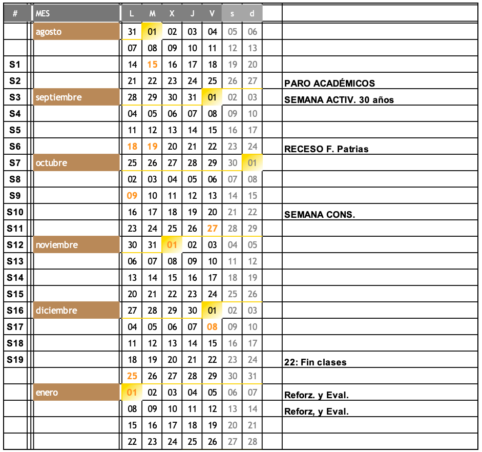

# Repositorio de información general para clases

**IMPORTANTE:** este repositorio está constantemente **EN CONSTRUCCIÓN**.

En este repositorio se deja a disposición de las y los estudiantes lineamientos para todos los cursos dictados por el profesor Felipe Muñoz Cañas.

### Temas administrativos

#### Comunicación

Mi correo electónico **institucional**. 

Para que como estudiantes tengan en consideración los tiempos de respuesta de correo, les invito a visitar [Tiempos de respuesta ULagos](https://felipe.micro.blog/emailulagos/).

En caso de eventos emergentes, la comunicación se realiza de forma directa con las o los **delegados** de cada sección. Por cada sección de las aisgnaturas que imparto es **responsabilidad** del estudiantado elegir a los menos a **dos** compañeras/os como **delegadas/os**. Esto debe ser informado a mi casilla de correo electrónico institucional. El plazo para esto es la semana 2 del calendario académico respectivo.

#### Atención de estudiantes

La atención de estudiantes se realiza en dos modalidades:

1. Videollamada por **Zoom** y
2. de manera presencial.

Para ambas modalidades les solicito por favor coordinar por correo electrónico un evento para la atención. 

Mis horarios de atención se establecen al principio de cada semestre.

1. Viernes 16:15 a 17:00hs.
2. (Por definir)

### Calendario

El calendario va a regirse por el número de cada semana y acorde al calendario académico del semestre en curso (2023-2). Por ejemplo, la semana 8 es la semana del 2 de octubre.

### Asignaturas dictadas este semestre 2023-2:

1. Programación Orientada a Objetos. Programa de asignatura: [Programa_POO](programas/poo.pdf)

    - Listado de secciones: [Listado POO](https://docs.google.com/spreadsheets/d/1VdTnpJh6GHsPu6KuppvAg3nYIRdiEebP/edit?usp=sharing&ouid=117143604802158233805&rtpof=true&sd=true)
    
2. Inteligencia Artificial. Programa de asignatura: [Programa_IA](programas/ia.pdf)
3. Diseño y Programación Web. Programa de asignatura: [Programa_DPW](programas/dpw.pdf)

4. Sistemas de control de procesos. Programa de asignatura: [Sistema de control de Procesos](programas/scp.pdf)
